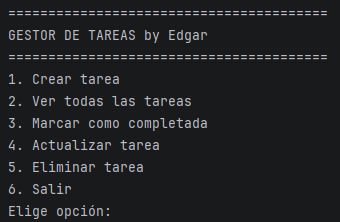

# Gestor de Tareas (Java + MySQL)

Aplicación de consola para la gestión de tareas, desarrollada como proyecto de práctica de arquitectura en capas durante 1º de DAM. Permite crear, listar, actualizar, eliminar y filtrar tareas por estado, con persistencia en una base de datos MySQL.

El objetivo principal del proyecto no es la funcionalidad en sí (un CRUD), sino practicar una separación de responsabilidades correcta: el código sigue el patrón **MVC** (Modelo-Vista-Controlador) junto con el patrón **DAO** (Data Access Object) para aislar la lógica de acceso a datos del resto de la aplicación. La gestión de dependencias se hace con **Maven**.

## Capturas



## Tecnologías

- **Java 21**
- **Maven** (gestión de dependencias y build)
- **MySQL 8.0**
- **JDBC** (mysql-connector-j 9.7.0, gestionado vía Maven)
- IntelliJ IDEA como entorno de desarrollo

## Arquitectura del proyecto

```
gestor-tareas/
├── database/                      # Script SQL para crear la base de datos y la tabla
├── img/                            # Capturas para este README
├── pom.xml                         # Definición del proyecto y dependencias Maven
└── src/
    └── main/
        └── java/
            └── com/edgar/tareas/
                ├── Main.java        # Punto de entrada de la aplicación
                ├── dao/             # ConexionBD (conexión a MySQL) y TareaDAO (consultas SQL)
                ├── modelo/          # Clase Tarea (representación del objeto de negocio)
                └── vista/           # MenuConsola (entrada de teclado y salida por pantalla)
```

**Por qué esta estructura:**
- **Modelo** (`Tarea`): solo datos, sin lógica de negocio ni de acceso a BD.
- **DAO** (`TareaDAO`): centraliza todas las consultas SQL. Si en el futuro cambiara el motor de base de datos, solo habría que tocar esta capa.
- **Vista** (`MenuConsola`): se encarga únicamente de la interacción con el usuario por consola, sin saber nada de SQL ni de JDBC.

## Funcionalidades

- Crear una nueva tarea.
- Listar todas las tareas o buscar una por ID.
- Actualizar el estado o los datos de una tarea existente.
- Eliminar una tarea.
- Filtrar tareas por estado.

## Decisiones técnicas

- **Maven** en lugar de gestionar el `.jar` del conector manualmente: las dependencias quedan declaradas en `pom.xml`, versionadas y reproducibles en cualquier máquina sin pasos manuales.
- **`PreparedStatement` en todas las consultas**, para evitar inyección SQL en lugar de concatenar strings.
- **`try-with-resources`** para gestionar conexiones y `Statement`/`ResultSet`, asegurando que se cierran automáticamente aunque se produzca una excepción.
- **`java.time.LocalDate`** para las fechas, en lugar de las clases antiguas (`Date`/`Calendar`), por ser la API moderna recomendada desde Java 8.
- No se ha usado un ORM (como Hibernate) de forma intencionada: al ser un proyecto de aprendizaje, el objetivo era entender qué hace JDBC "por debajo" antes de delegarlo en una librería.

## Requisitos previos

- Java 21 o superior instalado (`java -version`).
- Maven instalado, o usar el wrapper de Maven (`mvnw`) si está incluido en el proyecto.
- Un servidor MySQL 8.0 en ejecución (por ejemplo, vía **XAMPP**, MySQL Server o Docker). **Asegúrate de tener el servicio MySQL arrancado antes de ejecutar la aplicación**, o la conexión fallará con un error de tipo "Communications link failure".

## Instalación y puesta en marcha

1. **Clonar el repositorio**

   ```bash
   git clone https://github.com/edgarfariza/gestor-tareas.git
   cd gestor-tareas
   ```

2. **Crear la base de datos**

   Ejecutar el script `database/script.sql` en MySQL (crea la base de datos `gestor_tareas` y la tabla de tareas):

   ```bash
   mysql -u tu_usuario -p < database/script.sql
   ```

3. **Configurar la conexión**

   Editar las credenciales de conexión en `src/main/java/com/edgar/tareas/dao/ConexionBD.java` (usuario, contraseña y URL de tu instancia de MySQL).

4. **Compilar el proyecto con Maven**

   ```bash
   mvn clean install
   ```

   Esto descarga automáticamente el conector de MySQL y las demás dependencias declaradas en `pom.xml`.

5. **Ejecutar la aplicación**

   Desde IntelliJ IDEA: abrir el proyecto (se reconoce automáticamente como proyecto Maven) y ejecutar `Main.java`.

   O desde terminal:

   ```bash
   mvn exec:java -Dexec.mainClass="com.edgar.tareas.Main"
   ```

## Posibles mejoras futuras

- Externalizar las credenciales de la base de datos a un archivo `.properties` o variables de entorno, en lugar de tenerlas escritas directamente en `ConexionBD.java`.
- Añadir pruebas unitarias con JUnit sobre la capa DAO.
- Manejo de errores más robusto (validación de entradas del usuario, mensajes de error claros si falla la conexión).
- Plantearse una migración a una API REST con Spring Boot como evolución natural del proyecto.

## Autor

Edgar Fariza — estudiante de Desarrollo de Aplicaciones Multiplataforma (DAM), especialidad Cloud Computing, UAX FP.
